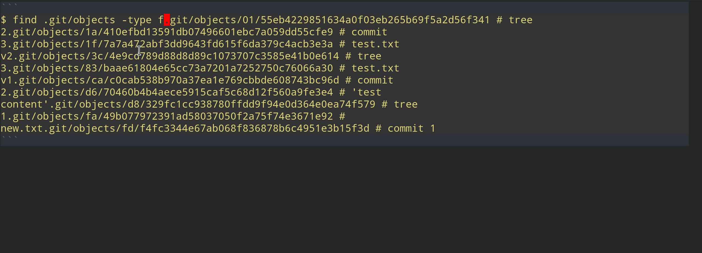
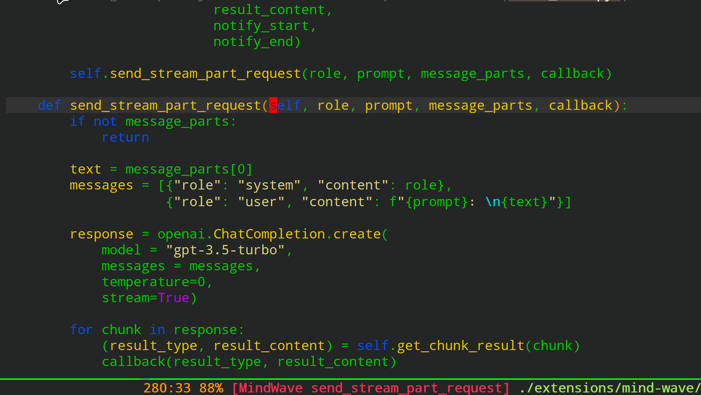
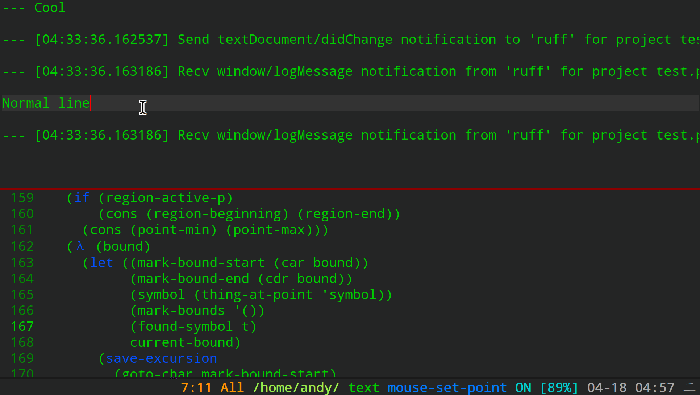

# What is markmacro?
markmacro is a plugin that apply keyboard macro for marked objects.

Let me show you some examples to expand the concepts of markmacro:

### Case 1


```python
fruit = apple watermelon peaches

=>

fruit = ["apple", "watermelon", "peaches"]
```

* select last three words
* `markmacro-mark-words` **mark words** in region and start kmacro record automatically
* Type `"` character, `forward-word`, type `"` character and `,` character
* `markmacro-apply-all` apply kmacro to all **mark words**

### Case 2


```python
it-is-ver-long-variable

=>

it_is_ver_long_variable
```

* `markmacro-mark-words` **mark words** in symbol and start kmacro record automatically
* delete `-` and type '_' character
* `markmacro-apply-all-except-first` apply kmacro to all **mark words** except first word

### Case 3


```python
flex-auto
flex-col

flex-col-reverse
flex-grow
flex-initial

flex-no-wrap
flex-none
flex-nowrap
flex-row

=>

prefix-flex-auto.txtt
prefix-flex-col.txtt

prefix-flex-col-reverse.txtt
prefix-flex-grow.txtt
prefix-flex-initial.txtt

prefix-flex-no-wrap.txtt
prefix-flex-none.txtt
prefix-flex-nowrap.txtt
prefix-flex-row.txt
```

* Select buffer
* `markmacro-mark-lines` **mark lines** in buffer and start kmacro record automatically
* Move to end of line, type `.txt` and move to beginning of line type `prefix-`
* `markmacro-apply-all` apply kmacro to all **mark lines** 

### Case 4


```elisp
("s-/" . markmacro-mark-WORDS)
("s-?" . markmacro-mark-LINES)
("s-<" . markmacro-apply-ALL)
("s->" . markmacro-apply-FIRST)

=>

("s-/" . markmacro-words)
("s-?" . markmacro-lines)
("s-<" . markmacro-all)
("s->" . markmacro-first)
```

* `markmacro-rect-set` record point at first line of rectangle, then move cursor to last line
* `markmacro-rect-mark-symbols` mark **all symbols** in rectangle area
* Move to end of line call `downcase-word`, and delete left word 
* `markmacro-apply-all` apply kmacro to all **mark symbols** 

### Case 5


```elisp
("s-/" . markmacro-mark-words)
("s-?" . markmacro-mark-lines)
("s-<" . markmacro-apply-all)
("s->" . markmacro-apply-all-except-first)
("s-M" . markmacro-rect-set)
("s-D" . markmacro-rect-delete)
("s-F" . markmacro-rect-replace)
("s-I" . markmacro-rect-insert)
("s-C" . markmacro-rect-mark-columns)
("s-S" . markmacro-rect-mark-symbols)

=>

(global-set-key (kbd "s-/") 'markmacro-mark-words)
(global-set-key (kbd "s-?") 'markmacro-mark-lines)
(global-set-key (kbd "s-<") 'markmacro-apply-all)
(global-set-key (kbd "s->") 'markmacro-apply-all-except-first)
(global-set-key (kbd "s-M") 'markmacro-rect-set)
(global-set-key (kbd "s-D") 'markmacro-rect-delete)
(global-set-key (kbd "s-F") 'markmacro-rect-replace)
(global-set-key (kbd "s-I") 'markmacro-rect-insert)
(global-set-key (kbd "s-C") 'markmacro-rect-mark-columns)
(global-set-key (kbd "s-S") 'markmacro-rect-mark-symbols)
```

* `markmacro-rect-set` record point at first line of rectangle, then move cursor to last line
* `markmacro-rect-insert` insert `(global-set-key `
* `markmacro-rect-set` record point at first line of rectangle, then move cursor to last line, `forward-char`
* `markmacro-rect-replace` replace `(` with `(kbd `
* `markmacro-rect-set` record point at first line of rectangle, then move cursor to last line
* `markmacro-rect-insert` insert `)`
* `markmacro-rect-set` record point at first line of rectangle, then move cursor to last line
* `markmacro-rect-delete` delete ` . `
* `markmacro-rect-set` record point at first line of rectangle, then move cursor to last line
* `markmacro-rect-mark-columns` mark **all columns** in rectangle area
* Delete right character and type `'`

### Case 6


```elisp
(defun test-function-1 (arg)
  )

(defun test-function-2 (arg)
  )

(defun test-function-3 (arg)
  )

=>

(defun test-function-1 (new-arg arg)
  )

(defun test-function-2 (new-arg arg)
  )

(defun test-function-3 (new-arg arg)
  )
```

* `markmacro-mark-imenus` mark **all functions** and start kmacro record automatically
* isearch `(` character
* Type `new-arg`
* `markmacro-apply-all` apply kmacro to all **mark functions** 

### Case 7


```elisp
(defun markmacro-mark-words ()
  (interactive)
  (let ((bound (if (region-active-p)
                   (cons (region-beginning) (region-end))
                 (bounds-of-thing-at-point 'symbol)))
        (mark-bounds '()))
    (when bound
      (when (region-active-p)
        (deactivate-mark))

      (let ((mark-bound-start (car bound))
            (mark-bound-end (cdr bound))
            (last-point 0)
            current-bound)
        (save-excursion
          (goto-char mark-bound-start)
          (while (and (<= (point) mark-bound-end)
                      (> (point) last-point))
            (setq current-bound (bounds-of-thing-at-point 'word))
            (when current-bound
              (add-to-list 'mark-bounds current-bound t))
            (setq last-point (point))
            (forward-word))))

      (dolist (bound mark-bounds)
        (let* ((overlay (make-overlay (car bound) (cdr bound))))
          (overlay-put overlay 'face 'markmacro-mark-face)
          (add-to-list 'markmacro-overlays overlay t)))

      (markmacro-select-last-overlay))))

=>

(defun markmacro-mark-words ()
  (interactive)
  (let ((bound (if (region-active-p)
                   (cons (region-beginning) (region-end))
                 (bounds-of-thing-at-point 'symbol)))
        (mark-bounds '()))
    (when bound
      (when (region-active-p)
        (deactivate-mark))

      (let ((mark-bound-start (car bound))
            (mark-bound-end (cdr bound))
            (last-point 0)
            new-current-bound)
        (save-excursion
          (goto-char mark-bound-start)
          (while (and (<= (point) mark-bound-end)
                      (> (point) last-point))
            (setq new-current-bound (bounds-of-thing-at-point 'word))
            (when new-current-bound
              (add-to-list 'mark-bounds new-current-bound t))
            (setq last-point (point))
            (forward-word))))

      (dolist (bound mark-bounds)
        (let* ((overlay (make-overlay (car bound) (cdr bound))))
          (overlay-put overlay 'face 'markmacro-mark-face)
          (add-to-list 'markmacro-overlays overlay t)))

      (markmacro-select-last-overlay))))
```

* Move cursor to left position of `(defun markmacro-mark-words`
* `mark-sexp` to selection region of `markmacro-mark-words` function 
* `markmacro-secondary-region-set` translate region to secondary region
* Move cursor to target (`current-bound` in this case), `markmacro-secondary-region-mark-cursors` mark **all targets** in secondary region
* Type something, `markmacro-apply-all` apply kmacro to **all targets**

### Case 8


```elisp
window.scrollTo(0, 0); document.getElementsByTagName('html')[0].style.visibility = 'hidden'; document.getElementsByClassName('lf_area')[0].style.visibility = 'visible'; document.getElementsByTagName('header')[0].style.display = 'none'; document.getElementsByClassName('contentPadding')[0].style.padding = '10px';

=> 

window.scrollTo(0, 0);
document.getElementsByTagName('html')[0].style.visibility = 'hidden';
document.getElementsByClassName('lf_area')[0].style.visibility = 'visible';
document.getElementsByTagName('header')[0].style.display = 'none';
document.getElementsByClassName('contentPadding')[0].style.padding = '10px';
```

* Move cursor to left position of `;`
* `markmacro-mark-chars` to selection **mark chars** `;` in string
* `forward-char` and `newline`
* `markmacro-apply-all` apply kmacro to all **mark chars**

### Case 9


```shell
$ find .git/objects -type f.git/objects/01/55eb4229851634a0f03eb265b69f5a2d56f341 # tree 2.git/objects/1a/410efbd13591db07496601ebc7a059dd55cfe9 # commit 3.git/objects/1f/7a7a472abf3dd9643fd615f6da379c4acb3e3a # test.txt v2.git/objects/3c/4e9cd789d88d8d89c1073707c3585e41b0e614 # tree 3.git/objects/83/baae61804e65cc73a7201a7252750c76066a30 # test.txt v1.git/objects/ca/c0cab538b970a37ea1e769cbbde608743bc96d # commit 2.git/objects/d6/70460b4b4aece5915caf5c68d12f560a9fe3e4 # 'test content'.git/objects/d8/329fc1cc938780ffdd9f94e0d364e0ea74f579 # tree 1.git/objects/fa/49b077972391ad58037050f2a75f74e3671e92 # new.txt.git/objects/fd/f4fc3344e67ab068f836878b6c4951e3b15f3d # commit 1

=> 

$ find .git/objects -type f
.git/objects/01/55eb4229851634a0f03eb265b69f5a2d56f341 # tree 2
.git/objects/1a/410efbd13591db07496601ebc7a059dd55cfe9 # commit 3
.git/objects/1f/7a7a472abf3dd9643fd615f6da379c4acb3e3a # test.txt v2
.git/objects/3c/4e9cd789d88d8d89c1073707c3585e41b0e614 # tree 3
.git/objects/83/baae61804e65cc73a7201a7252750c76066a30 # test.txt v1
.git/objects/ca/c0cab538b970a37ea1e769cbbde608743bc96d # commit 2
.git/objects/d6/70460b4b4aece5915caf5c68d12f560a9fe3e4 # 'test content'
.git/objects/d8/329fc1cc938780ffdd9f94e0d364e0ea74f579 # tree 1
.git/objects/fa/49b077972391ad58037050f2a75f74e3671e92 # new.txt
.git/objects/fd/f4fc3344e67ab068f836878b6c4951e3b15f3d # commit 1
```

* Move cursor to **second** `.git`, and select to end of string
* `markmacro-secondary-region-set` translate region to secondary region
* Select **second** `.git`
* `markmacro-secondary-region-mark-cursors` mark all **.git**
* Press RETURN char, `markmacro-apply-all` apply kmacro to **.git**

### Case 10


```python
def send_stream_part_request(self, role, prompt, message_parts, callback):
    pass
=> 

def send_stream_part_request(
        self, 
        role, 
        prompt, 
        message_parts, 
        callback):
    pass
```

* Move cursor to function
* `markmacro-mark-parameters` to selection **parameters**
* `newline`
* `markmacro-apply-all` apply kmacro to all **parameters**

### Case 11


```python
--- Cool

--- [04:33:36.162537] Send textDocument/didChange notification to 'ruff' for project test.py

--- [04:33:36.163186] Recv window/logMessage notification from 'ruff' for project test.py

Normal line

--- Cool feature

=> 

--- Cool feature

--- Cool feature

--- Cool feature

Normal line

--- Cool feature
```

* Move cursor to `---`
* `markmacro-mark-symbols` to selection all `---` in buffer
* Type something
* `markmacro-apply-all` apply kmacro to all lines start with `---` 

## Installation

Clone or download this repository (path of the folder is the
`<path-to-markmacro>` used below).

In your `~/.emacs`, add the following two lines:

```Elisp
(add-to-list 'load-path "<path-to-markmacro>") ; add markmacro to your load-path
(require 'markmacro)

(global-set-key (kbd "s-/") 'markmacro-mark-words)
(global-set-key (kbd "s-?") 'markmacro-mark-lines)
(global-set-key (kbd "s-:") 'markmacro-mark-chars)
(global-set-key (kbd "s-L") 'markmacro-mark-imenus)
(global-set-key (kbd "s-<") 'markmacro-apply-all)
(global-set-key (kbd "s->") 'markmacro-apply-all-except-first)
(global-set-key (kbd "s-M") 'markmacro-rect-set)
(global-set-key (kbd "s-D") 'markmacro-rect-delete)
(global-set-key (kbd "s-F") 'markmacro-rect-replace)
(global-set-key (kbd "s-I") 'markmacro-rect-insert)
(global-set-key (kbd "s-C") 'markmacro-rect-mark-columns)
(global-set-key (kbd "s-S") 'markmacro-rect-mark-symbols)
```

## Contributor

<a href = "https://github.com/manateelazycat/markmacro/graphs/contributors">
  
</a>
